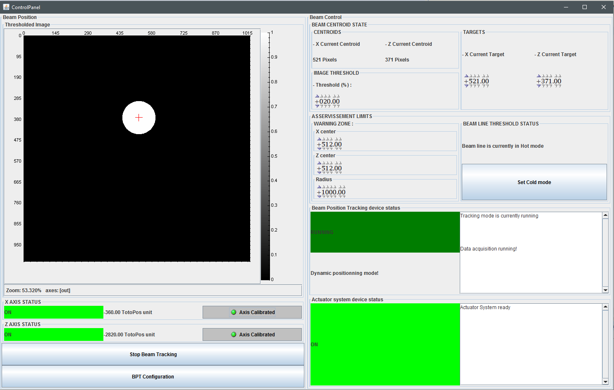

---------------------
Beam Position Tracking Project
---------------------
BeamPositionTracking is an application based on Tango Devices (http://www.tango-controls.org/) that will be used on beamlines to enslave the beam position on a specific target. 

The back-end is made of two Tango Devices :
* [ActuatorSystem](https://rawgit.com/fthiam/BeamPositionTracking/master/TangoDevices/ActuatorSystem/ActuatorSystem/doc/doc_html/index.html) :  This device's aim is to organize movements on X and Y axis

* [BeamPositionTracking](https://rawgit.com/fthiam/BeamPositionTracking/master/TangoDevices/BeamPositionTracking/BeamPositionTracking/doc/doc_html/index.html): This device will estimate new centroids using it's sensor. At every step it will estimate a new axis position using a PID corrector.

Theses devices will be able to work with differents types of sub-devices for translations and several detectors such as Lima detector and XBPM using Yat4Tango::Plugin technology.

On top of those devices comes an JAVA application based on COMETE framework

---------------------
Falilou THIAM
falilou.thiam@synchrotron-soleil.fr
---------------------
